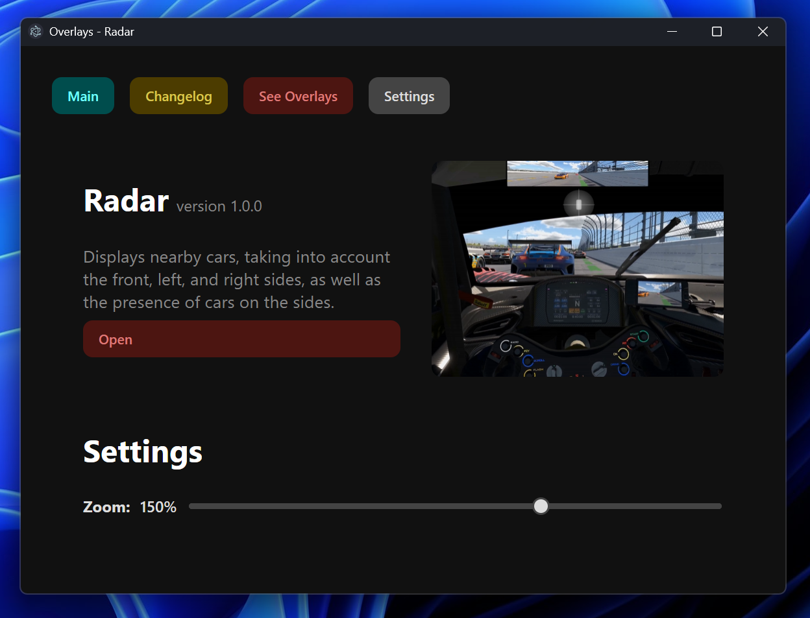

# iRacing Overlays

**iRacing Overlays** is a lightweight desktop application built with **Electron** and **FastAPI**, designed to display live iRacing telemetry.

## 🖼️ Screenshots

## 📦 Features

- Live telemetry display for iRacing.
- Fast and responsive overlays with smooth updates.
- Always-on-top windows styled with HTML/CSS.
- Modern web stack (**FastAPI**, **Electron**, **JavaScript**).

## 🛠️ Installation

Download the latest version from [releases](https://github.com/onesch/iracing-overlays/releases/tag/publish).

## 🧑‍💻 Contributing

Pull requests and issues are welcome.
Check out the full [guide here](https://github.com/onesch/iracing-overlays/blob/electron-version/docs/CONTRIBUTING.md).

# 📄 License

[GPL-3.0](https://github.com/onesch/iracing-overlays/blob/electron-version/LICENSE) License.
