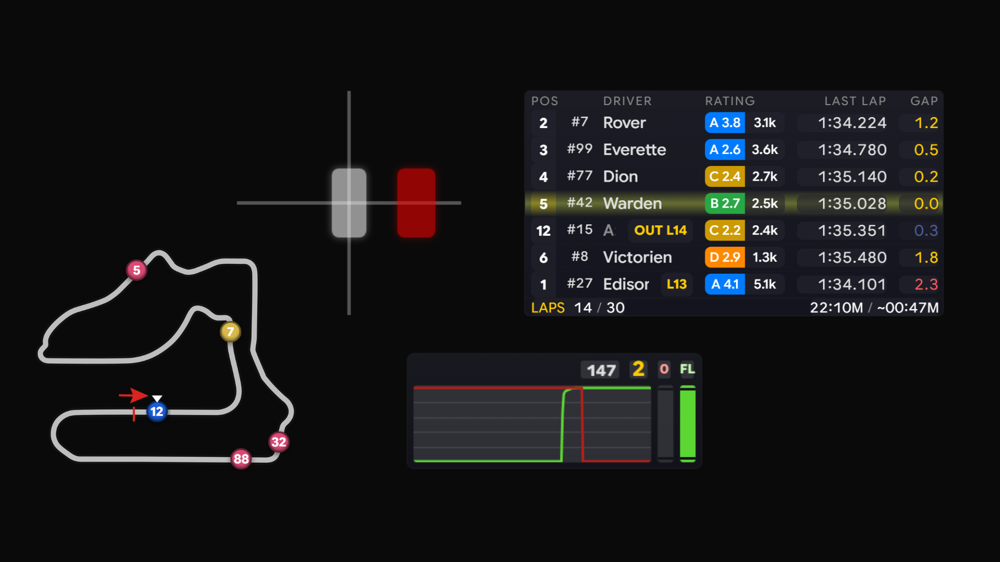

# iRacing Overlays

**iRacing Overlays** is a lightweight desktop application designed to ***display live iRacing telemetry***. Powered by ***FastAPI*** & ***Electron***.

## 🖼️ Screenshots

## 🛠️ Installation

1. Go to the [Latest Release](https://github.com/onesch/iracing-overlays/releases/tag/publish).
2. Download the latest installer.
3. Run it and launch the app.

## 🤝 Contributing

Contributions, issues, and feature requests are welcome!  
Read our [Contributing Guide](docs/CONTRIBUTING.md) for details.

## 📜 License

Distributed under the [GPL-3.0 License](LICENSE).  
© 2025 onesch. All rights reserved.
